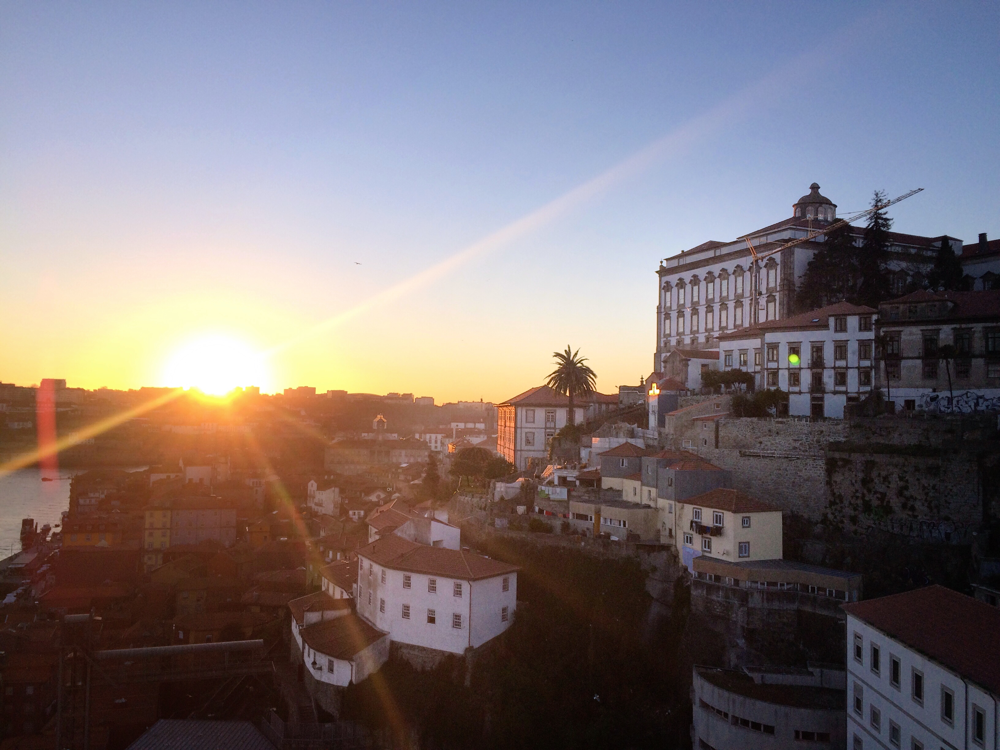
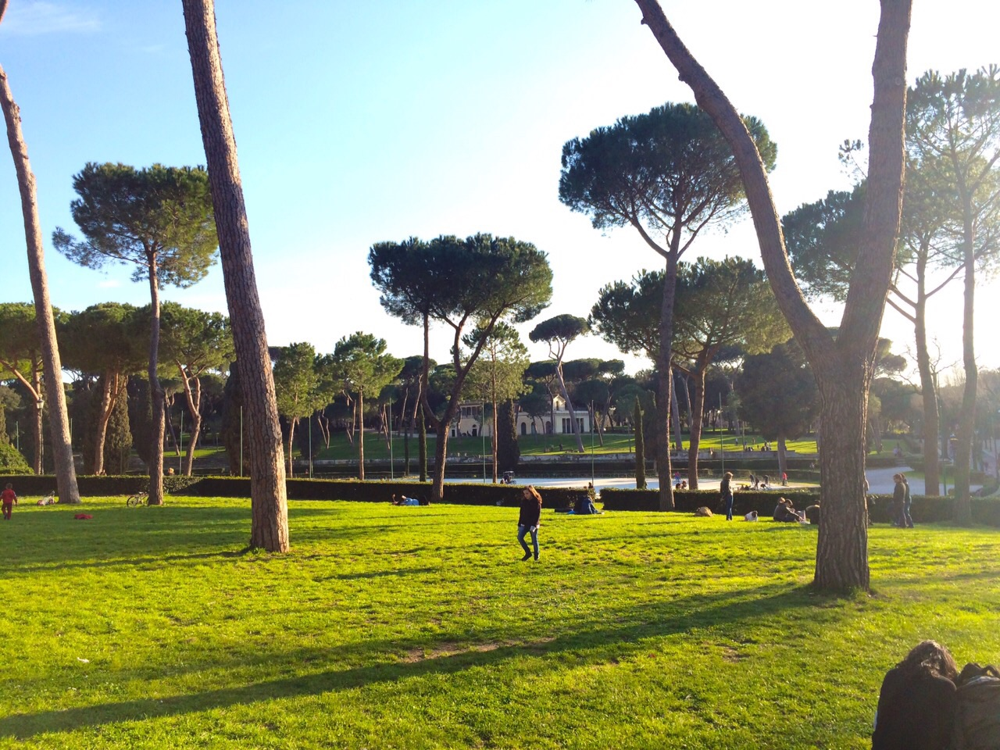
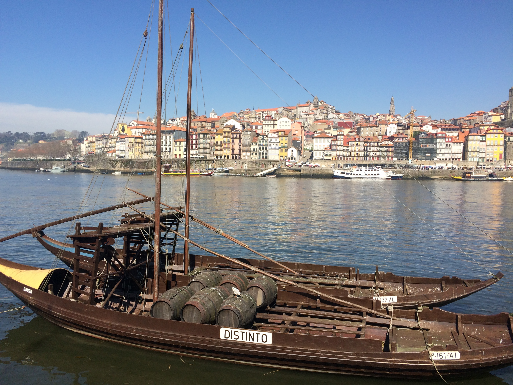
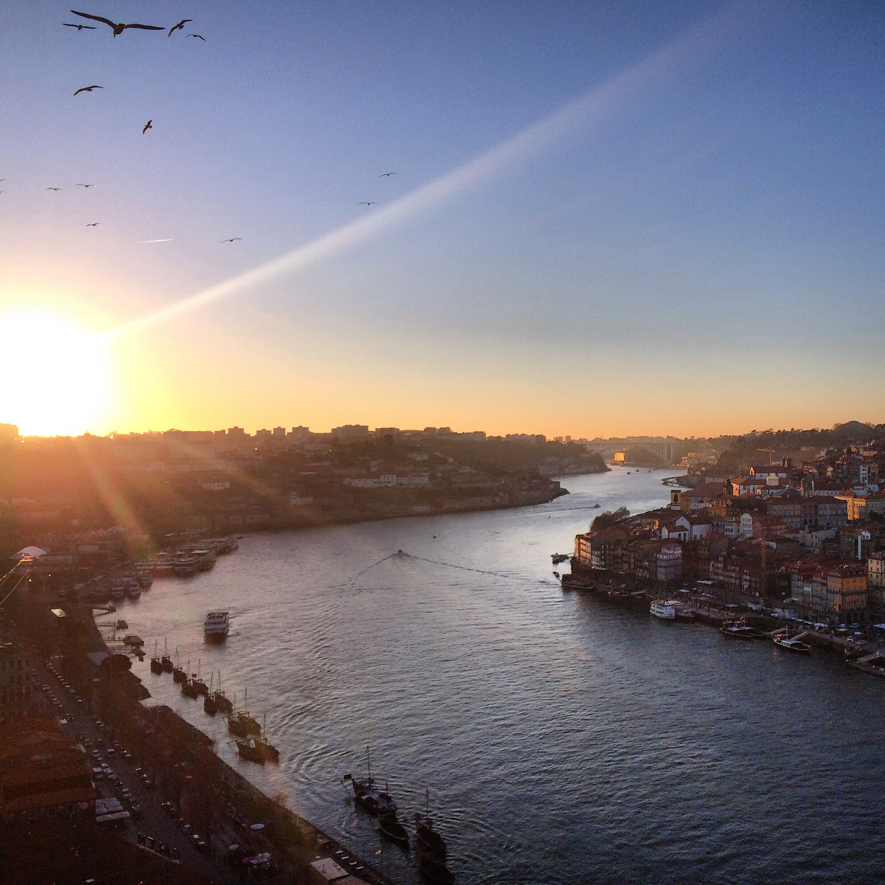
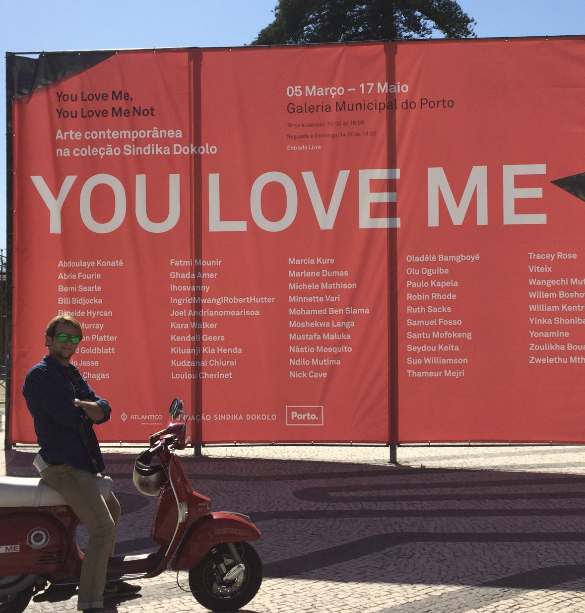

I went to Porto back in 2015 for a long weekend.  Definitely worth checking it out but I personally wouldn't allocate more than 3-4 days there and 2 days would be enough.  There's just too much other amazing stuff to see on the Iberian Peninsula to spend more days than that in Porto.

Here are the things I did that I'd recommend:
- Eat a Francesinha.  I won't try to explain what it is here, but just ask when you get there.  They'll serve it everywhere and it's worth trying.  However, don't plan strenuous exercise activities for immediately afterwards - it's gunna be a gut bomb.
- Clerigos Tower.  It's a top tourist attraction.  You can go up in the top of the church tower and get a great view of the whole city. 
- The Lello Bookstore: pretty cool looking old bookstore.  Very famous and worth popping in if you're going to the tower anyway (it's right nextdoor). 
- A Port Tasting: The entire east side of the river is covered in port warehouses.  I'd say this is probably the most unique thing about Porto, so I'd definitely recommend doing a tour of one of them and a tasting.  We went to "Taylors", which was awesome and had a great view of the city from the tasting area.
- Walk the Pont Luis I across the River Duoro (Pont = Bridge in Portuguese).  It's the main iconic span in the middle of the city. Great views and basically takes you from the cathedral on the north side to a cool old monastery on the south side.  You can then hop down into the area that has all the wineries.
<!--  -->

  

- Crystal Palace Gardens are pretty with good views of the city, though not a "must see". 

- The cathedral up at the top of the hill on the north side of the river is pretty ancient.
- You could take a river tour on one of the old wooden boats they have there.  I didn't do this but that was mostly due to scheduling.  I also saw a place to take helicopter tours that looked like they might be pretty fun and a cool way to see some of the Duoro River Valley.

- Just chill and enjoy the beauty of an old and historic city!!

### Getting Around: 

If you're staying downtown, you can pretty much plan to walk everywhere you need to go to see the sites listed above. In fact, I'd say one of the perks of a trip to Porto is that everything is quite walkable.  I'd recommend starting on the North side of the river, seeing some of those sites, and then walking across the bridge and over to the port warehouses for a tasting.  

We rented a scooter (it was dirt cheap) and sped all over the city.  It's a good way to cruise out to the ocean if you want to get a feel for more than just the downtown area.  I personally felt drawn to go down to the river mouth to the beach and port.  It was fun to imagine just how many ships had cruised out past those lighthouses and out to explore the world.

### Next Steps:

Outside of the city of Porto is the Duoro River Valley.   It's where they grow a lot of the port and is likened to famous (and famously beautiful) wine growing regions like Napa Valley.  A drive along the coast north of the city is also beautiful country.  Either of those options could be a good way to add an extra day or two to your trip.